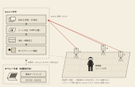

# fixed-cam-vr

公式サイト: [website/](website/)
ローカル起動: `cd website` → `npm run dev`

廻リ視の当日画面は [設営と点検](tools/web-compositor/README.md#現行の入口2026-09-22)。
`tools/web-compositor/serve.ps1` で新しいサーバを起動し、`http://localhost:8099/` を開く。
カメラ A/B/C と Quest α/β を固定して確認する。博士タブレットは応答と設定の反映を分けて確認する。
演出は準備素材 → ビルド用同梱 → APK → 起動中の Quest を内容とビルド識別子で照合する。
Player は APK に入れた演出だけを使う。Web 卓の更新と旧設定キャッシュは適用しない。
ビルド後に変更できる設定は博士 UI から直接届く言語とホラー軽減だけ。博士 UI の日本語4場面は音声付きリップシンク動画を使う。
通常サーバは演出変更の POST を拒否する。事前編集が必要な場合のみ `FIXEDCAM_AUTHORING=1` で起動する。
旧 `/onsite.html` は当日画面へ転送する。
人が歩く場所と構図、Quest 2 台の映像・音・入力を確認した記録は 1 時間有効で、切断や設定変更で解除される。
スマホ 3 台が未接続のため、配信アプリの実機更新と動作は未検証。

このプロジェクトは VR アプリ「廻リ視（FixedCam）」だけを持つ。

| アプリ | 一言で | コード | シーン | パッケージ ID |
|---|---|---|---|---|
| **[廻リ視（FixedCam）](#廻リ視fixedcam--固定視点ホラー-vr)** | 固定視点カメラのホラー VR（IVRC2026 出展企画） | `Assets/Scripts/`（`FixedCamVr.*`） | `Main.unity` | `com.roiril.mawarimi` |

手のアプリ 2 つ（TableDuo / MyCobotHand）は 2026-09-28 に [Roiril/table-duo-vr](https://github.com/Roiril/table-duo-vr) へ分離した。

スタック：**Unity 2022.3.62f2 LTS / URP / Meta XR All-in-One SDK / Quest 3（Android・IL2CPP・ARM64）**。

## 目次

- [廻リ視（FixedCam）](#廻リ視fixedcam--固定視点ホラー-vr) — 概要 / 実装状況 / 動かし方 / 入力
- [ビルド & デプロイ](#ビルド--デプロイ)
- [HMD なし・Editor での検証](#hmd-なしeditor-での検証)
- [ドキュメント一覧](#ドキュメント一覧) / [ディレクトリ](#ディレクトリ) / [開発フロー](#開発フロー)

---

# 廻リ視（FixedCam） — 固定視点ホラー VR

1990年代のサバイバルホラーで用いられた固定カメラ視点を、HMDと複数の実カメラを使って現実空間に再構成した体験作品である。体験者の視界には、周囲の景色ではなく、位置に応じて切り替わる3台のカメラ映像が映し出される。これにより、自分自身がホラーゲームやホラー映画の主人公になったような感覚を味わうことができる。映像には CG 合成とフィルタでホラー演出を重ねる。



> **カメラは動かず、体験者が動く。** 会場の床に三脚で固定した Android スマホ 3 台が MJPEG を Wi-Fi 配信し、体験者の Quest 3 が HMD の位置からゾーンを判定してカメラを選び、演出を重ねて VR スクリーンに描画する。演出は**本番前**に Web オペレータ卓でオーサリングして `show.json` として APK に焼き込むため、本番中の PC は緊急制御と疎通診断だけを担う（→ [演出の事前オーサリング](#演出の事前オーサリング--ビルド焼き込みphase-37-の使い方)）。図の実体は [docs/figures/system-architecture.svg](docs/figures/system-architecture.svg)（1 単位 = 1mm のベクタ。予稿にそのまま貼れる）。

## 実装状況

用途未定の独立した表示部品として [不正アクセスのエラー演出](docs/unauthorized-access-effect.md) を用意した。
崩れる警告文字と奥行きのある数字を 7 秒で再生する。本編の進行には未接続。

| Phase | 内容 | 状態 |
|---|---|---|
| 1–2.5 | MJPEG 受信（[Streaming/](Assets/Scripts/Streaming/)）・スクリーン描画・複数カメラ切替 | ✅ 実機動作確認済み |
| 2.7 | プレイヤー位置連動カメラ切替（[Tracking/](Assets/Scripts/Tracking/)）。形状は show.json layout（PC）+ 位置合わせは HMD 2 点登録（CourseRegistrationController） | 🚧 登録フロー実装済み・実機未検証 |
| 3 | 映像加工 4 系統プロトタイプ（[Fx/](Assets/Scripts/Fx/)。本命 = CRT + 薄い埃） | ✅ Editor 検証済み・本実装前 |
| 3.5 | 映像差し替え（OverlayCue）+ Web オペレータ卓遠隔制御（ShowControlClient / [tools/web-compositor/](tools/web-compositor/)） | ✅ 実装済み・運用検証中 |
| 3.7 | **タイムライン第一級オーサリング**（周回×ゾーン区間から cue 割当・画像加工 post 上書き・別カメラのインサートショットを一括編集 + APK 焼き込みで現地 PC 不要 + Web 矢印キー検証。LapCounter / CueScheduler / InsertController / TimelineDirector） | 🚧 実装済み・実機未検証 |
| 3.8 | **接続の堅牢化**（端末 ID・UDP 発見・疎通診断を実装。当日運用の A/B/C は固定登録を優先し、自動追従は OFF） | 🚧 現行の固定登録はスマホ 3 台未接続で実機未検証 |
| 3.9 | **ビューア体験の改善**（yaw 追従の緩急・切替クールダウン/dip-to-black・cue 中切替凍結・信号ロスト砂嵐・HUD 既定 OFF） | 🚧 実装済み・試着未検証 |
| 3.95 | **BGM オーサリング**（区間ごとに曲の切替・停止・ループ範囲・音量・クロスフェード。BgmDirector / BgmPlanLogic + Web 卓の BGM ライブラリと BGM 帯） | 🚧 実装済み・実機未検証 |
| 3.97 | **ショーシミュレータ**（フロアマップのドットを歩かせて実機なしでショーを検証。ゾーン確定・周回・演出発火・画面切替を Unity と同じ純ロジックで再現し、[golden トレース](Assets/Tests/Fixtures/scenario_walk.trace.json)で Web⇄Unity の一致を機械固定。`ShowScenarioRunner` / `ZonePickLogic` + 卓の 🕹 パネル） | ✅ 一致テスト green・ブラウザ実測済み |
| 3.98 | **演出専用カメラ D**（`cameras[].role:"fx"` = どのゾーンにも割り当てず演出のカットからだけ映すカメラ。スタッフの A 巡回・ゾーン自動切替から除外。配信アプリ側も cameraId に D を追加 v0.8.0） | 🚧 実装済み・実機未検証 |
| 3.99 | **CG 人形**（映像の上に立つ 3D。体験者の**ハンドトラッキング**で腕が動く。実カメラ姿勢の双子の仮想カメラで描き、ポスト FX の前に合成。ShowCgLayer / ShowActorRig / TwoBoneIk + 卓の 🎭 パネルと 📐 カメラ姿勢モード） | 🚧 実装済み・Editor 静止画で検証・実機未検証 |
| 3.995 | **通過ライン**（演出の開始規則に「体験者がこのラインを通過したら」を追加。フロアマップに線を引いて `layout.lines` へ保存し、演出が `at:"line"` で参照。**ラインは担当カメラに紐づく**ので他の領域で踏んでも発火しない。通過方向・通らなかった時の扱い・取り違えの警告つき。LineCrossLogic + 卓の 📏 通過ラインモード） | 🚧 実装済み・実機未検証 |
| 3.996 | **CG 合成の作り直し**（実カメラを実映像から**較正**して姿勢・画角・レンズ歪みを解く / 部屋の 3D プロキシで**影・接地影・オクルージョン** / 照明の著作 / 映像クリックでの人形配置 / Editor で合成結果を PNG に焼く）。像空間のズレ 3 件（合成 UV・RT アスペクト・画角の軸）を潰したのが起点 | 🚧 実装済み・実機未検証 |
| 3.997 | **体験の骨格**（企画書の「3 区間を 3 周・導入を含め 3 分以内」を状態機械に。導入 → 本編 → 終了の 3 相・周回の上限・終了の暗転・ラン経過の時計。`ShowRunLogic` / `ShowRunDirector` / `ShowEndingFader` + 卓のラン状態パネルと ⚙ 欄） | 🚧 実装済み・実機未検証 |
| 3.998 | **映像の乱れ（グリッチ）**（企画書「ノイズやグリッチ等の乱れを一時的に重畳でき、継ぎ目の隠蔽や注意・移動の誘導に用いる」。カットの遷移 / カット頭 / ゾーン切替 / 卓の手動の 4 経路。`GlitchFx` / `GlitchEnvelopeLogic`）。あわせて **post を 12 項目へ**（色収差・低解像度化・走査線の本数）と**色統計マッチングの実機適用**（卓が 6 float へ落として cue へ焼く） | 🚧 実装済み・実機未検証 |
| 3.999 | **遅延の観測**（到着の揺らぎ / 展開 / 提示 / 配信側の鮮度を分けて出す。**絶対の end-to-end は測っていない** — 配信端末と Unity で時計の基準が違うため）。配信側の熱による降格中は lag 再接続を抑止。表示レート 90Hz を実行時要求 | 🚧 実装済み・実機未検証 |
| 3.9995 | **体験の音**（それまで BGM ループ 1 本だけで、タイトル・導入 13.1 秒・隔離・破砕・すり替え・切替・乱れ・信号断・終幕・周回の劣化が**全部無音**だった。「現実の音」と「装置の音」の 2 層を置き、装置の声を**絵より先に**入れる。素材 17 本は自前合成。BGM の遷移を等パワーへ直し（それまで振幅線形で中央に -3dB の谷）、隔離は音量ではなく**帯域**で表す。`SoundBedLogic` / `SoundCueLogic` / `SoundFade` / `ShowSoundDirector`。設計は [.claude/rules/sound-design.md](.claude/rules/sound-design.md)） | 🚧 実装済み・EditMode 1168/1168・実機で `ev=sfx` まで確認・**聴いた人の判定は未取得** |
| 4 | スクリーン外 3D 演出 | 未着手 |

主要コンポーネントの仕様（エンドポイント・遅延対策・show.json 設定契約・スクリーン合成モデル）は [.claude/rules/streaming.md](.claude/rules/streaming.md) に集約。
音の設計・実機の物理・素材の作り方は [.claude/rules/sound-design.md](.claude/rules/sound-design.md) が正本（`tools/make-sounds.py` で焼き、`tools/sound-lint.py` で検査し、`tools/sound-pitch.py` で声の高さを測り、`tools/sound-preview.py` で人に聴かせる。笑い声のつまみ台は [tools/laugh-lab/](tools/laugh-lab/README.md)）。
**劇伴だけは出口が違う** — `tools/make-bgm-track.py` がもらった曲から切り出して `tools/web-compositor/audio/` へ置き、卓が URL で配る（APK には焼かない）。

### 演出の事前オーサリング → ビルド焼き込み（Phase 3.7 の使い方）

1. Web 卓（`tools/web-compositor/serve.ps1` → `http://localhost:8099/authoring.html`）の **タイムライン**が正面。周回×ゾーン区間（セグメント）が並ぶ
2. **フロアマップ**で担当カメラを塗り、「周回コース」で**スタート領域と順方向（CW/CCW）**を決めて保存（区間の並び順を決める）
2.5. **位置で演出を出すなら**フロアマップの **📏 通過ライン**で床に線を引く（ドラッグで引く・端点で伸縮・線をドラッグで平行移動）。
   **線には担当カメラが付く**（引いた場所のゾーンから自動。一覧で変更可）。演出はその担当カメラの区間からしか選べず、
   **他の領域で踏んでも何も起きない**。通過方向（両方向 / 矢印の向きだけ / 逆だけ）も一覧で選ぶ
3. **区間をクリック → インスペクタ**で、その周・そのカメラに対して一括編集：
   - **cue 割当**（複数可・遅延秒・1 回のみ・強度/フェード/trim の区間上書き）。既存 cue の割当かその場で新規 cue 作成（素材 + マスク + フェード + 再生区間）
   - **画像加工 post の上書き**（このゾーン滞在中だけ露出・色を変える。例「2 周目の B だけ赤く」）
   - **インサートショット**（別カメラを N 秒差し込む。`退出時`=このゾーンを離れる瞬間に差し込み / `進入時`=入って N 秒後）
   - **開始規則**（演出インスペクタの「開始」）: `進入から +t 秒` / `離脱時` / **`このラインを通過したら`**（📏 の線を選ぶ。
     選択肢はその区間のカメラが担当する線だけ。通らなかった時は「出さない（ラインの既定）」か「離脱時に出す」）
   - **BGM**（このゾーンで曲を切り替える / 止める。ループ範囲 in-out・音量・フェード。指示の無い区間は前の曲が続く）。
     音源は `tools/web-compositor/audio/` に置き「🎵 BGM ライブラリ」でトラック登録する。
     **⚠ 初回は `.\tools\unity.ps1 menu scene` を 1 回実行**して [Bgm] を BgmDirector 化すること
4. **▶ 検証**（矢印キー：→ 次ゾーン / ← 戻る / R 先頭 / Esc）で、実機なしに発火順と「体験者に見える画」をブラウザで確認（ローカルのみ・show.json は書かない）
5. **📦 ビルド用エクスポート** → show.json + 参照アセットが `Assets/StreamingAssets/show/` に焼き込まれる（コミット禁止・gitignore 済み）
6. 通常どおり APK ビルド → **Quest 単体（PC 不在）で周回に応じて自動発火**。Web 卓のライブ操作（演出 ON/OFF）は常にタイムラインより優先

### 演出専用カメラ D と CG 人形（Phase 3.98 / 3.99 の使い方）

**カメラ D＝周回に出てこないカメラ。** 演出のカットから `映すもの = ライブカメラ / カメラ D` で呼ぶ。

1. 配信スマホ側で **cameraId を D** にする（[fixed-cam-streamer](https://github.com/Roiril/fixed-cam-streamer) v0.8.0 以降）
2. 卓のカメラ列で **＋ カメラを追加**（4 台目は自動で「演出専用」）。Unity 側は `Phone04.asset` と `StreamingLogic.prefab` の `sources[]` 4 本目が対応済み
3. フロアマップのゾーン塗りパレットに D は出ない（＝周回に組み込まれない）。スタッフの A ボタン巡回にも出ない

**CG 人形＝映像の上に立つ 3D。体験者のハンドトラッキングで腕が動く。**

1. Unity で **Tools > FixedCamVr > Setup > Build Show Actor Prefab**（humanoid の FBX を選択 or 既定の Mixamo Remy）→ `Assets/Resources/ShowActors/<名前>.prefab` ができる
2. 卓の **🎭 CG 人形**パネルで人形を追加し、プレハブ名（`ShowActors/Remy`）と身長を入れる
3. **先に部屋を測る**（フロアマップの **🧱 部屋**モード）。壁と箱をドラッグで引き、床の寸法を実測値にする。
   **較正はここから始まる** — 卓の既定値（1m×1m の L 字壁・0.15m のタイル格子）は現場の床に目印が無いので、
   その座標を打っても実物と違う場所を指したまま解くことになる（合わない原因の第一位）。
   実物のある目印は較正パネルの地図で **［印を置く］**（棚の脚・テープの× 等）でも足せる。
   **床の寸法だけなら較正パネルの中で直せる**（実測点が足りないときに欄が出る）。測って入れれば四隅が実測点になる。
   この部屋の形は ①人形が隠れる壁 ②影の落ち先 ③較正の参照 を兼ねる。
   **💡 CG 照明**パネルで光の向き・色温度・強さ・影の濃さを合わせる
4. **カメラを較正する**（カメラ列の［🎯 姿勢を合わせる］）。映像に写っている床の既知点を 4〜6 個クリックすると、
   位置・向き・画角・レンズ歪みが解ける。解けたら**部屋のワイヤーが実映像に重なる**ので、目で合っているか確かめる
   （点線は「まだ測っていない幾何」なので、ずれていても較正のせいではない）。
   **これをやらないと人形は正しい場所に立たない**（📐 カメラ姿勢モードの手置きは概算のフォールバック）
   - 結果の 1 行目が **「実際のずれ およそ N cm」**（1 点を伏せて解き直したときの中央値）。
     当てはまり（px）は「打った点に合ったか」でしかなく、4 点なら誤差 0 でも解が嘘のことがある
   - **画角は一度だけ丁寧に測って［📌 レンズとして登録］**するのがコツ。焦点距離も毎回推定すると位置が 27cm ずれ、
     固定すれば 2cm に収まる。登録したレンズは**同じ機種のカメラで使い回せる**（測定条件も一緒に残る）
   - **壁の縦エッジ（床の角とその真上）を 2〜3 本**入れると、床だけでは分離しない画角と距離が決まる（誤差 7cm → 1cm）
   - カメラを動かしたら 2〜4 点を打ち直すだけ（30 秒）。前回の点は名前つきで復元される。
     置き直したなら［🗑 全部消す］。保存し直して失敗したら［↩ 元に戻す］（1 世代）
   - ライブが来ていなくても **［📁 保存した映像から］** で較正できる（現場で撮っておいて後で解く運用）
5. 演出のカットで **CG 人形**を選び、立ち位置を「体験者の位置（分身）」か「決めた位置」から選ぶ。
   決めた位置は **［📍 画面で置く］で映像の床を直接クリック**できる（輪郭がその場で追従する）
6. 確認は Play せずに 2 つ:
   - **Diagnostics > Preview Show Actor** — 人形単体のポーズと腕（`Assets/Screenshots/actorviz/`）
   - **Diagnostics > Preview Show Composite** — **実写プレート × 人形 × 影の合成結果**（`Assets/Screenshots/cgviz/`）。
     カメラごとに `calibcheck_*.png`（プレート + 部屋ワイヤー）も焼かれる。**最終的な見た目の一次証拠はこれ**

設計・不変条件は [.claude/plans/2026-07-27_cg-compositing-rebuild.md](.claude/plans/2026-07-27_cg-compositing-rebuild.md)
（合成の基盤）と [2026-07-27_cg-actor-hand-tracking.md](.claude/plans/2026-07-27_cg-actor-hand-tracking.md)（腕の駆動）。

## 動かし方（最短）

1. **配信側**: 各スマホで MJPEG 配信を起動（下表）。当日運用の A/B/C は `operations-fleet.json` の固定登録 `.21/.22/.23:8080` と端末の ID・UUID を照合する。`show.json` のローカル接続値をコミットしない
2. **Unity**: `Main.unity` を開き（**Ctrl+Shift+M**）、必要なら **Tools > FixedCamVr > Setup > Setup Main Demo Scene**（Zones / Tracker / HUD を冪等再配置）→ Play（Quest Link）or 実機ビルド
3. 疎通確認は **Tools > FixedCamVr > Diagnostics > Ping DroidCams**、または `Phone01.asset` Inspector の **Test Connection**

| 配信アプリ | port | videoPath | 備考 |
|---|---|---|---|
| **[fixed-cam-streamer](https://github.com/Roiril/fixed-cam-streamer)**（自作・Android 標準） | 8080 | `/video` | `/info`（自動回転メタ）・`/health`（品質モニタ）・レンズ切替・露出ロック |
| **IP Camera Lite**（iPhone 標準） | 8081 | `/video` | Basic 認証（既定 admin/admin）。CameraSource の username/password に入力 |
| DroidCam / IP Webcam | 4747 / 8080 | `/mjpegfeed?WxH` / `/video` | フォールバック |

配信側の設置のコツ（露出ロック・auto-IDLE・前面維持）は [fixed-cam-streamer README](https://github.com/Roiril/fixed-cam-streamer)、層別の切り分けは [.claude/rules/troubleshooting.md](.claude/rules/troubleshooting.md)。

## 入力早見表

右コントローラはスタッフが持つ。体験者は左 X / Y で報告する。スタッフ操作は右 A / B / トリガーに集約し、誤操作しやすい右グリップは使わない。モードは Normal / Registration の 2 状態。

| 状態 | 入力 | 機能 |
|---|---|---|
| Normal（既定） | 右 **A** 2 秒長押し | ランリセット（周回=1・ワンショット演出クリア。体験者交代時） |
| Normal | 右 **B** 短押し | ステータス表示トグル（StatusHud） |
| Normal | **右トリガー 2 秒長押し** | コース登録モードへ入場 |
| Registration | 右 **A** | 点サンプル（0.5 秒ホールド平均・誤差 % ライブ表示）/ Verify 中はやり直し |
| Registration | 右 **B** | Verify で確定・保存・退場 |
| Registration | **右トリガー 2 秒長押し** | キャンセル退場（入場と対称） |
| Normal / Registration | 右グリップ | 未使用 |
| 常時（体験者の入力ではない） | 左 **グリップ** | **体験中の撮影**（説明資料用）。押した瞬間の画を 4 種類、端末へ PNG で保存する。Development ビルドは既定で有効。**展示本番の機は必ず OFF**（下） |
| （Editor） | キーボード **Tab / 1–9 / Space / H** | カメラ切替・head-lock・ステータス（HMD なし検証・ゲート対象外） |

**体験中の撮影（左グリップ）**: 押した瞬間の ① 表示されているスクリーン ② 加工前の生映像 ③ 合成しているものだけ（合成が無い瞬間は撮らない・CG が出ていれば透過の 1 枚も） ④ 体験者の視界 を、1 回 1 フォルダで `Android/data/com.roiril.mawarimi/files/shots/` へ書く（左が 1 発震える）。取り出しと ON / OFF は `tools/quest-shots.py`。
左グリップは体験者が握り込むときに普通に押されるので、**展示本番の機は `py -3.11 tools/quest-shots.py off`**。④ にはパススルーの現実は入らない（アプリの描画のみ）。詳細は [memory/experience_shots.md](.claude/memory/experience_shots.md)。

```powershell
py -3.11 tools/quest-shots.py pull --delete   # → logs/shots/<serial>/<日時_通し番号>/ へ取り出して端末から消す
py -3.11 tools/quest-shots.py off             # 展示本番の前に（アプリを再起動すると反映）
```

ステータス（StatusHud）は単一サーフェスで、lap / 現在ゾーン / 次の cue 予定 / 信号 ●●○ / 要再登録 を緩追従（deadzone + SmoothDamp）で 1 枚に表示。登録中は登録ガイダンスを強制表示する。モード状態（NORMAL/REG）は heartbeat（`mode`）でも Web 卓に出る。旧 Run/Staff・左手・スティック・操作チートシート（StaffPanel）・cue 試射は撤去した。

---

# ビルド & デプロイ

**Unity は CLI で操作する。** 入口は [tools/unity.ps1](tools/unity.ps1) だけで、Editor を GUI で開かない。

```powershell
.\tools\unity.ps1 doctor            # 前提（Editor / Android モジュール / py / adb / 焼き込みの新しさ）
.\tools\unity.ps1 build fixedcam    # → Builds/mawarimi.apk
.\tools\unity.ps1 build fixedcam -Release
```

**`build fixedcam` は毎回、卓の著作を APK へ焼き込んでから焼く**（`tools/export-show-build.py` が
`tools/web-compositor/show.json` と参照素材を `Assets/StreamingAssets/show/` へ写す）。
卓の「📦 ビルド用エクスポート」を押す必要は無い。飛ばすなら `-NoExport`。

**手動 Build Settings は使わない。** [BuildVariants.cs](Assets/Editor/BuildVariants.cs) が productName / パッケージ ID / シーンをビルド時に決める：

| `build <app>` | 出力 | パッケージ ID | シーン |
|---|---|---|---|
| `fixedcam` | `Builds/mawarimi.apk` | `com.roiril.mawarimi` | Main.unity |

```
adb -s <serial> install -r --no-streaming Builds\mawarimi.apk
```

手順詳細・APK 完成ポーリングは [quest-build スキル](.claude/skills/quest-build/SKILL.md)。

# HMD なし・Editor での検証

**Editor すら開かずに済むものは CLI で撮る。** `.\tools\unity.ps1 menu` が一覧を出す
（合成 `composite` / HMD 内の文字 `hud` / 人形の動き `actor-motion` / 位置合わせ `regviz` …）。

| 経路 | 対象 | 手順 |
|---|---|---|
| EditMode テスト | ロジックの回帰 | `.\tools\unity.ps1 test`（走る前に必ずコンパイルするので、コンパイル確認も兼ねる） |
| Editor プレビュー | 合成の絵・HMD 内の文字・人形・位置合わせ | `.\tools\unity.ps1 menu <名前>` → `Assets/Screenshots/<種類>/` |
| 結果画面 | 3 言語の帰還・未報告・中断 | `.\tools\unity.ps1 menu ending-record` → 専用フォントと `Assets/Screenshots/ending/` |
| Flat デバッグシーン | 廻リ視のストリーミング系 | **Ctrl+Shift+D** → Play → Tab/数字で切替（OVR 無しの通常シーン） |
| streaming-offline-test | スマホ実機なしで MJPEG E2E | fake server を立てて検証（[スキル](.claude/skills/streaming-offline-test/SKILL.md)） |
| Quest Link | 実機に近い Editor Play | Build Target = Standalone のまま、XR Plug-in（Windows）で Oculus を有効化 → Link 接続 → Play。**72Hz 上限**なので性能評価は実機 APK で |

**HMD を被らずに体験を丸ごと通す**（実機 APK は要る・被る必要は無い）:

```bash
bash tools/run-quest-xp-test.sh walk 300
```

導入 → 3 周 → 終了を自動走行し、`[XP]` テレメトリを取って show.json の著作と突き合わせる。
「出るはずで出なかった演出」「録れなかった区間」「砂嵐の割合」「受信 fps」が数値で出る。
手順・収集の罠・ベースライン実測 → [.claude/memory/onsite_experience_test.md](.claude/memory/onsite_experience_test.md)

終幕の未報告分岐は `py -3.11 tools/quest-record.py --walk --no-report --sec 180` で録画する。
`--no-report` は検証専用の起動フラグ。通常起動の入力には影響しない。
終了条件と結果画面の数の定義は [.claude/memory/ending_result.md](.claude/memory/ending_result.md)。

⚠ **Link/HMD 無しの Editor で OVR シーンを Play するとハングする**（[.claude/reference/mcp-unity.md](.claude/reference/mcp-unity.md)）。

# ドキュメント一覧

| ファイル | 内容 |
|---|---|
| **[docs/proposal/](docs/proposal/)** | **企画書（唯一の正）**。体験の要求はすべてここが根拠 |
| [docs/archive/](docs/archive/) | 廃止した資料（旧版の企画書）。**参照しない** |
| [TROUBLESHOOTING.md](TROUBLESHOOTING.md) | 配信不通 / HMD 真っ黒 / FPS 低下 / 実機検証で得た知見 |
| [docs/onsite-checklist.md](docs/onsite-checklist.md) | 現場での 60 秒チェック → 切り分けフロー |
| [docs/ivrc-video/](docs/ivrc-video/) | IVRC2026 ビデオ審査の制作プラン一式 |
| [tools/web-compositor/README.md](tools/web-compositor/README.md) | 当日の設営と点検、演出編集、映像合成検証ツール |
| [Roiril/fixed-cam-streamer](https://github.com/Roiril/fixed-cam-streamer)（別リポ） | 配信側 Android アプリ |
| [CONTRIBUTING.md](CONTRIBUTING.md) | コミット規約・ブランチ運用 |
| [.claude/rules/](.claude/rules/) | 領域別の作業規約（streaming / meta-xr / unity-vr / troubleshooting 等） |
| [.claude/plans/](.claude/plans/) | 実装計画書（完了済みは git log 参照） |

# ディレクトリ

```
fixed-cam-vr/
├── Assets/
│   ├── Scripts/              # 廻リ視本体（Streaming / Tracking / Fx / Diagnostics / OvrBridge）
│   ├── Scenes/               # Main.unity / Debug/ / Sandbox/ / FxSandbox.unity
│   ├── Art/                  # マテリアル + 映像加工シェーダ/Compute
│   ├── Prefabs/              # MjpegScreenStage / StreamingLogic 等
│   ├── Settings/             # URP / Quality / CameraSource SO（Cameras/Phone01–04。04 = 演出専用カメラ D）
│   ├── Oculus/ Resources/ XR/ # Meta XR / OVR / XR 設定
│   └── Tests/                # EditMode テスト（Streaming / Tracking / Fx / Input / Diagnostics）
├── docs/                     # onsite-checklist / onsite/ / ivrc-video/ / figures/
├── tools/                    # unity.ps1 / web-compositor / quest-record.py 等
├── Builds/                   # APK 出力（gitignore）
├── Packages/ ProjectSettings/ # 依存・エディタ設定（変更は要注意 — CLAUDE.md 禁止事項）
├── .claude/                  # Claude Code ハーネス（rules / plans / memory / skills）
├── CLAUDE.md
└── README.md
```

# 開発フロー

- シュビー（Claude Code）と共同開発。動作モード・領域別ルールは [CLAUDE.md](CLAUDE.md) が入口
- 実装計画は `.claude/plans/YYYY-MM-DD_<slug>.md`、コミットは日本語 `<type>：<要約>` 形式
- 検証方針: Editor（EditMode テスト / Editor プレビュー / Link）で潰せるものは実機に持ち込まない。実機ビルドは最後
