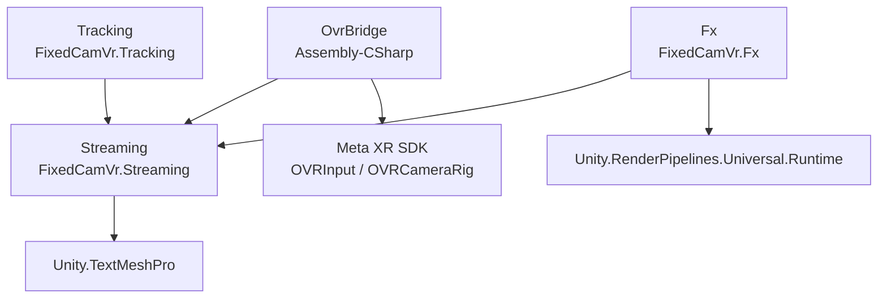
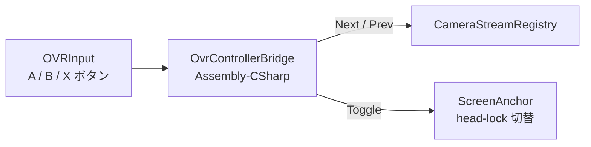

# アーキテクチャ

fixed-cam-vr のモジュール依存関係とデータフロー。

## モジュール依存関係



- `OvrBridge` は **asmdef を持たない**（Assembly-CSharp に同梱）。Meta XR SDK の `OVRInput` を直接参照できる唯一の場所として、コントローラ入力を `Streaming` のコンポーネント（`CameraStreamRegistry` / `ScreenAnchor`）へ橋渡しする。
- `Tracking` は HMD 位置から `CameraStreamRegistry.SetActive` を呼ぶため `Streaming` に依存。逆方向の依存はない。
- `Fx` は映像加工の検証群。URP の RendererFeature / Blit / Compute / Particle を使い分ける。

## モジュール責務一覧

| モジュール | asmdef | namespace | 主要型 | 責務 |
|---|---|---|---|---|
| Streaming | `FixedCamVr.Streaming` | `FixedCamVr.Streaming` | `CameraSource` (SO) / `MjpegStreamReceiver` / `CameraStream` / `CameraStreamRegistry` / `MjpegScreen` / `ScreenAnchor` / `CameraSwitchInput` / `CurrentSourceLabel` | MJPEG 受信・デコード・複数ソース管理・Quad 描画・キーボード切替 UI |
| Streaming.Editor | `FixedCamVr.Streaming.Editor` | `FixedCamVr.Streaming.Editor` | `CameraSourceEditor` / `CameraStreamRegistryEditor` / `FixedCamVrMenu` / `HierarchySeparator` | Inspector 拡張、`Tools > FixedCamVr` メニュー、Hierarchy 強調表示 |
| Tracking | `FixedCamVr.Tracking` | `FixedCamVr.Tracking` | `PlayerZone` / `PlayerZoneTracker` | HMD 位置から AABB ゾーン判定し、`CameraStreamRegistry` のアクティブ切替（ヒステリシス + 優先度比較） |
| Fx | `FixedCamVr.Fx` | `FixedCamVr.Fx.*` | `FxCrtPostFxController` / `FxBlitChromaticAberration` / `DustOverlayBuilder` / `SobelEdgeRunner` / `FxScreenTextureFeeder` / `FxSourceBinder` / `FxTestPatternSource` | 映像加工 4 系統プロトタイプ（CRT / 色収差 / 埃 / Sobel） |
| Fx.Editor | `FixedCamVr.Fx.Editor` | `FixedCamVr.Fx.Editor` | `FxRendererSetup` / `FxSandboxBuilder` | FxSandbox シーン生成・CRT Material 生成メニュー |
| OvrBridge | （なし） | `FixedCamVr.OvrBridge` | `OvrControllerBridge` | OVRInput → Streaming コンポーネントへの入力転送 |

## データフロー：MJPEG 受信から Quad 描画まで

```mermaid
graph LR
    Phone[スマホ<br/>DroidCam / IP Webcam] -->|MJPEG over Wi-Fi<br/>multipart/x-mixed-replace| Receiver[MjpegStreamReceiver<br/>別スレッド受信<br/>byte[] ダブルバッファ]
    Receiver -->|最新フレーム byte[]| Stream[CameraStream<br/>Texture2D.LoadImage<br/>メインスレッド]
    Stream -->|Texture2D| Registry[CameraStreamRegistry<br/>複数ソース保持<br/>ActiveIndex 管理]
    Registry -->|ActiveStream.Texture| Screen[MjpegScreen<br/>Renderer.mainTexture]
    Screen --> Quad[Quad<br/>Unlit Material]
```

1. **`CameraSource`**（ScriptableObject）が `host` / `port` / `path` から MJPEG URL を組み立てる
2. **`MjpegStreamReceiver`** が別スレッドで `multipart/x-mixed-replace` を読み続け、最新フレームを `byte[]` のダブルバッファで保持。接続失敗時は最大 30 秒の exponential backoff
3. **`CameraStream`**（プレーンクラス、IDisposable）が `Tick()` をメインスレッドから受け、`Texture2D.LoadImage(bytes, markNonReadable: false)` で焼き込む（Texture2D は再利用、フレーム内 GC アロケなし）
4. **`CameraStreamRegistry`**（MonoBehaviour）が複数 `CameraStream` を常時受信し、`ActiveIndex` を管理（`Next()` / `Prev()` / `SetActive(int)` / `ActiveChanged` イベント）
5. **`MjpegScreen`** が `Registry.ActiveStream.Texture` を `Renderer.mainTexture` に焼き、Quad に表示

## データフロー：プレイヤー位置連動カメラ切替

```mermaid
graph LR
    HMD[OVRCameraRig<br/>CenterEyeAnchor] -->|world position<br/>毎 0.05s サンプル| Tracker[PlayerZoneTracker]
    Zones[PlayerZone[]<br/>AABB + priority] --> Tracker
    Tracker -->|包含判定 + 優先度比較<br/>ヒステリシス 0.15m| Registry[CameraStreamRegistry]
    Registry -->|SetActive cameraIndex| Screen[MjpegScreen]
```

- `PlayerZone` は **AABB**（中心 + halfExtents）で空間ゾーンを定義。`cameraIndex` / `priority` / `label` を持ち、`ExecuteAlways` で Scene ビューに gizmo 表示
- `PlayerZoneTracker` は HMD の world 位置を一定間隔（既定 0.05 秒）でサンプル
- 「現ゾーンは shrink 判定（0.15m 内側） / 他ゾーンは正規判定」のヒステリシスで境界フリッカを防止
- 包含するゾーンの中で最大 priority を選び、`Registry` のアクティブを切り替える
- どのゾーンにも入っていない時は `keepLastWhenOutside`（既定 true）で直近を維持

## データフロー：OVR コントローラ入力



- A (右) → `Registry.Next()`
- B (右) → `Registry.Prev()`
- X (左) → `ScreenAnchor.Toggle()`（head-lock の ON/OFF）

## データフロー：Fx（Phase 3 プロトタイプ）

| 系統 | 経路 |
|---|---|
| 3-1 CRT | `MjpegScreen` → URP カメラ → `FullScreenPassRendererFeature` (`FxCrtPostFx.shader`) → 表示 |
| 3-2 色収差 | `FxScreenTextureFeeder` → `Graphics.Blit`（`FxChromaticAberration.shader`） → 出力 RT → 表示 Material |
| 3-3 埃オーバーレイ | `DustOverlayBuilder` が `ParticleSystem` を World Space で配置、Quad の前面に重ねる |
| 3-4 Sobel | `FxScreenTextureFeeder` → Compute Shader (`FxSobel.compute`、3 kernel: Sobel / SobelOverlay / Reinhard Tonemap) → 出力 RT → 表示 Material |

`FxSourceBinder` がストリーミング Texture / テストパターン (`FxTestPatternSource`) のどちらを入力にするかを切替。

## ディレクトリと責務の対応

```
Assets/Scripts/
├── Streaming/        # Phase 1 / 2 / 2.5 — MJPEG 取り込み・複数ソース管理・キーボード切替
│   └── Editor/       # Inspector 拡張・メニュー・Hierarchy 装飾
├── Tracking/         # Phase 2.7 — プレイヤー位置連動カメラ切替
├── Fx/               # Phase 3 — 映像加工 4 系統プロトタイプ
│   ├── Blit/         # Graphics.Blit ベース
│   ├── Compute/      # Compute Shader ベース
│   ├── Particles/    # ParticleSystem ベース
│   ├── RendererFeature/  # URP RendererFeature ベース
│   ├── Source/       # Fx 入力ソース抽象化
│   └── Editor/       # FxSandbox シーン / CRT Material 生成
└── OvrBridge/        # Meta XR OVRInput → Streaming への橋渡し（asmdef なし）
```

## 関連ドキュメント

- [README.md](../README.md) — 全体像・フェーズ表・初回セットアップ
- [CONTRIBUTING.md](../CONTRIBUTING.md) — 開発フロー・コミット規約
- [TROUBLESHOOTING.md](../TROUBLESHOOTING.md) — 詰まりやすい箇所
- [docs/performance.md](performance.md) — Quest 3 90Hz 維持の計測手順
- [.agent/plans/](.agent/plans/) — フェーズ別の実装計画
